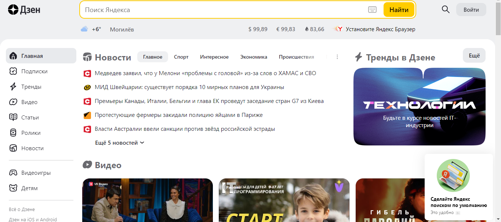
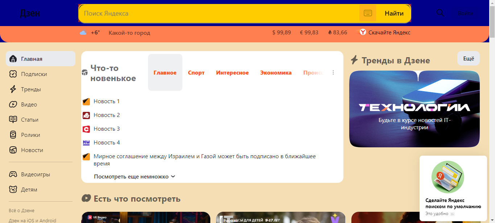
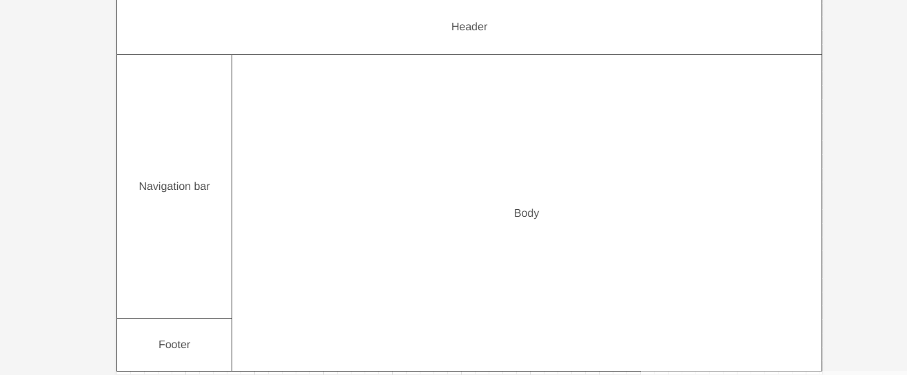

Сайт yandex.ru работает на протоколе https

# Изменения

1. Изменен цвет head на синий
2. Изменен цвет head на коралловый
3. Название города изменено на "Какой-то город"
4. Цвет body изменен
5. "Еще 5 новостей" измене
6. Удалена картинка из шапки возле "Дзен"
7. "Установите Яндекс браузер" зменено на "Скачайте Яндекс"
8. Изменен цвет заголовков "Главное", "Спорт" и тд.
9. Заголовки новостей изменены на "Новость 1", "Новость 2" и тд.
10. "Видео" изменено на "Есть что посмотреть"
11. Так же изменены размеры шрифтов и размер виджета "Новости"

ДО

ПОСЛЕ

ПРОТОТИП НИЗКОЙ ДЕТАЛИЗАЦИИ

